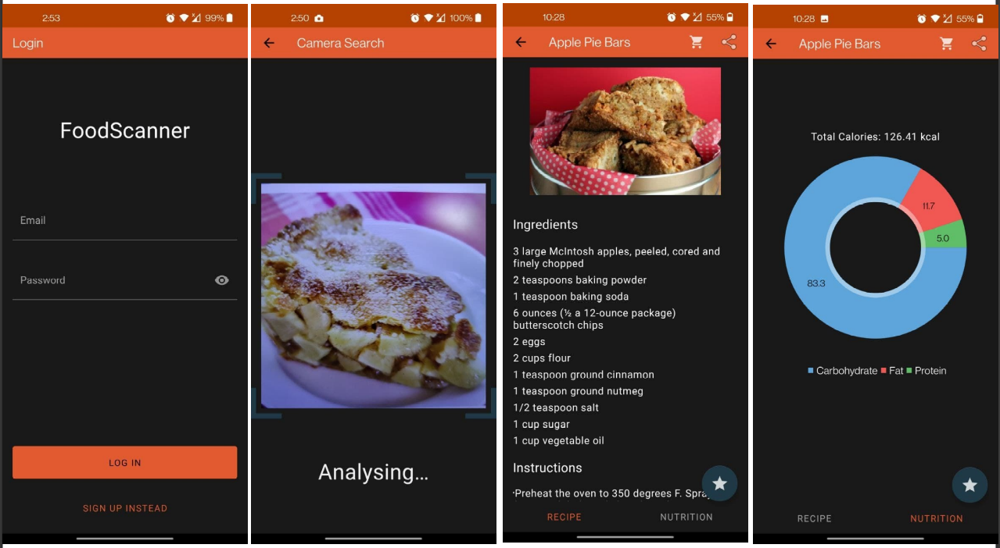
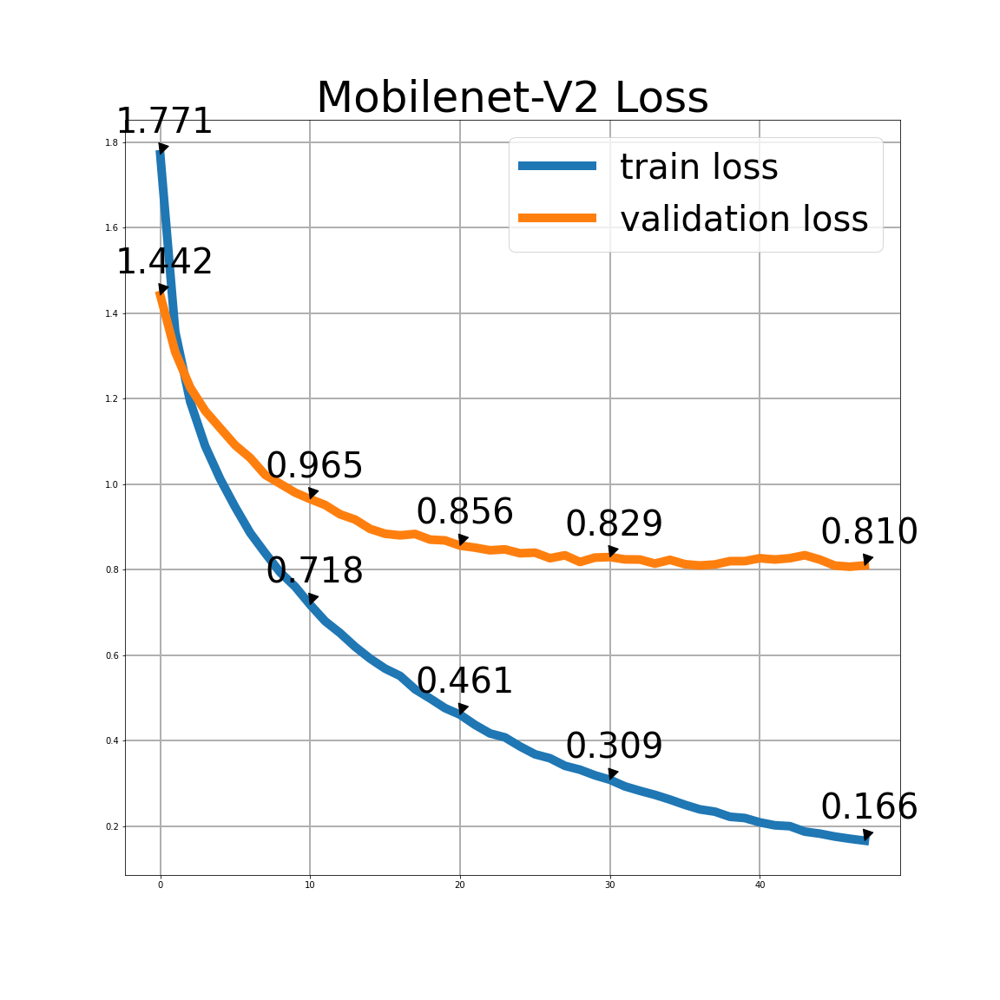
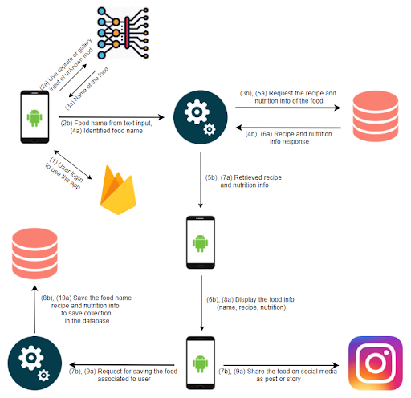

# Food Scanner

## Project Description

In Food Scanner, you can search your desired food with your cellphone’s camera in real time, or with images saved in your gallery or simply by typing the name of the food. This search flexibility helps you identify the foods that you encounter anytime anywhere. You can identify unknown foods during your far east vacation by using camera search or you can easily display information about the food that you see on social media by using a screenshot.

After finding the desired food, you can check all the cool information about your food. In the recipe page, you can view the list of ingredients with instructions to cook your food in the best way. Furthermore, you can find the total calorie of the food along with the calorie distribution in the nutrition page.

You can save all the information about your desired food for future use. Moreover, you can automatically add all the necessary ingredients of your desired recipe to your cart on online market applications with one tap.

## Demo

You can find the demo video in the `demo/demo.mp4` file.

## Model

We use Mobilenet-v2 architecture for our food classification system. Mobilenet-v2 architecture is developed by Google, it is a considerably small model which is very important for computing power. So it is one of the most appropriate models to use in mobile devices due to its reasonable performance despite its small number of parameters. For example, one of the best known image classification models Resnet-50 has around 26 million parameters, on the other hand  Mobilenet-v2 has only around 5 million parameters. Despite the huge difference between the parameter numbers, Mobilenet-v2 has around 73% top-1 accuracy where Resnet-50 has around 76% top-1 accuracy. As a result, we choose Mobilenet-v2 model because of its fair accuracy and low computational cost.

 

## System Design

